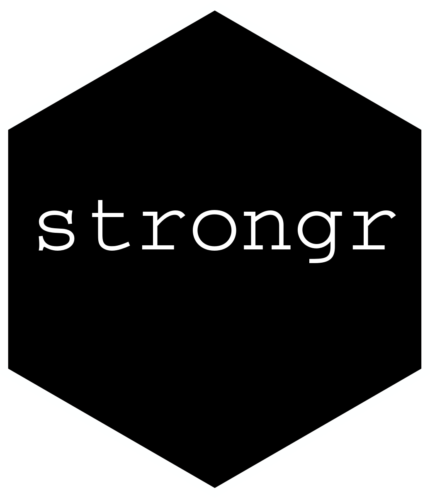

<!-- README.md is generated from README.Rmd. Please edit that file -->

```{r, include = FALSE}
knitr::opts_chunk$set(
  collapse = TRUE,
  comment = "#>"
)
```

# strongr 

<!-- badges: start -->
[](https://github.com/kdschneider/strongr/actions/workflows/check-standard.yaml)
[](https://codecov.io/gh/kdschneider/strongr)
[](https://lifecycle.r-lib.org/articles/stages.html#experimental)
<!-- badges: end -->

> Work in progress!

## Overview

The goal of strongr is to allow easy creation of workout-plans and logging of progress.
  
## Installation

```{r eval = FALSE}
# Install the development version from GitHub:
# install.packages("devtools")
devtools::install_github("kdschneider/strongr")
```

## Usage

<center>
  
</center>
