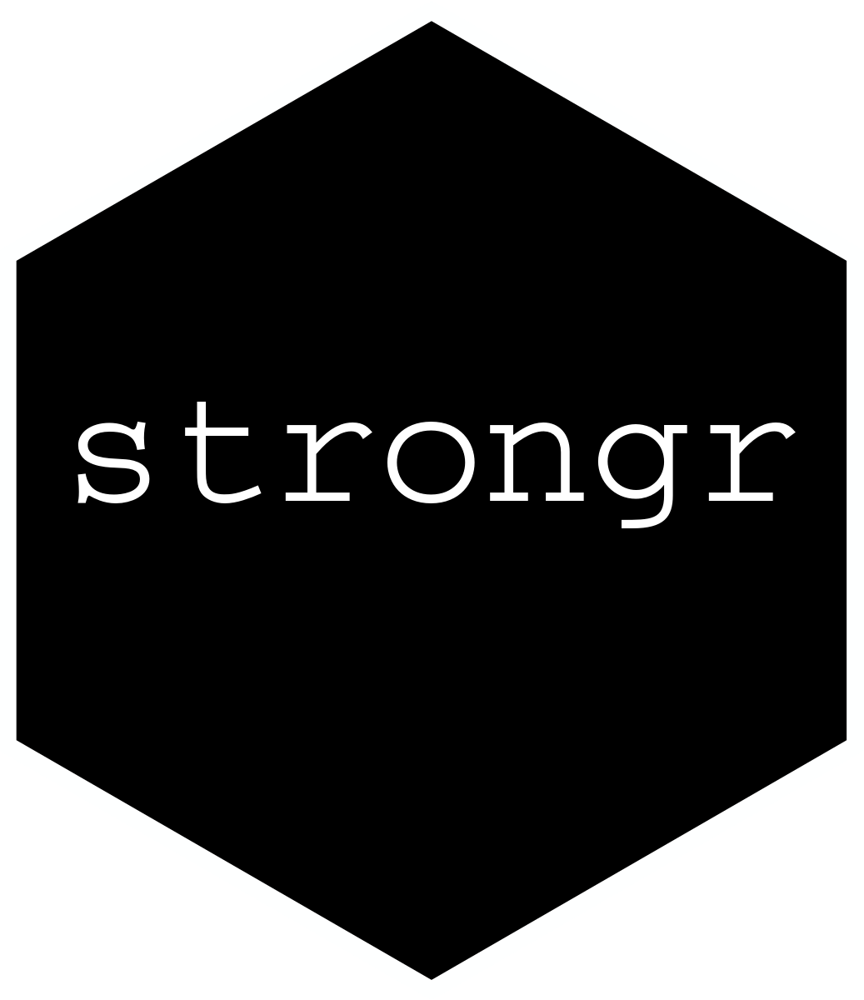

<!-- README.md is generated from README.Rmd. Please edit that file -->

# strongr 

<!-- badges: start -->

[](https://github.com/kdschneider/strongr/actions/workflows/check-standard.yaml)
[](https://github.com/kdschneider/strongr/actions/workflows/codecov.yaml)
[](https://lifecycle.r-lib.org/articles/stages.html#experimental)
<!-- badges: end -->

> This package is very much work in progress!

## Overview

The goal of strongr is to allow easy creation of workout-plans and
logging of progress.

As of now the planned functions are:

-   `create_plan()`: Create a workout-plan from a set of input
    parameters and/or workouts.
-   `create_workout()`: Create a specific workout. One or more workouts
    can be used to create a plan.
-   `add_training()`: Add a training session to the workout-plan. You
    should be able to specifiy if a set was failed.
-   `get_next_training()`: Get weights (maybe with warmup weights) for
    the next training session.
-   `deload()`: Failed `x` sets in a row? Time to face the truth and
    deload…

## Installation

``` r
# Install the development version from GitHub:
# install.packages("devtools")
devtools::install_github("kdschneider/strongr")
```

## Usage

`no use as of now, just garbage...`
